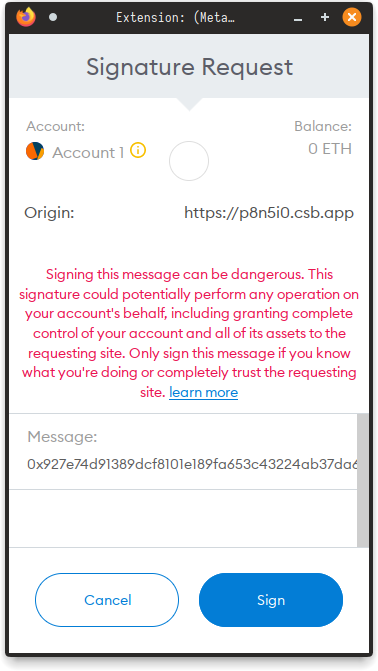

= web3-provider-sponsoring

When sending transactions via metamask, it first checks if user has enough balance to pay for gas fees

However, at unique chain, we have sponsoring, and user without balance can submit transaction to chain,
without having money, and without using any middlewares (GSN for example)

To make it work with metamask, we should skip gas check, this library does this trick

== Using

This library works as wrapper around another provider

I.e you refer to metamask as `window.ethereum`, you should wrap it as:

[source,js]
----
import SponsoringProvider from 'web3-provider-sponsoring';

new Web3(new SponsoringProvider(window.ethereum));
----

== Implementation

As Metamask only checks balance when handling `eth_sendTransaction`, we instead intercept this call,
and then handle it ourselves by signing transaction via `eth_sign`, and then sending it directly
via `eth_sendRawTransaction`

This way, metamask can't show user call info, it only warns about possibly unsafe usage of `eth_sign` call

[%collapsible]
====

====

This message will be removed, after metamask implements `eth_signTransaction`
